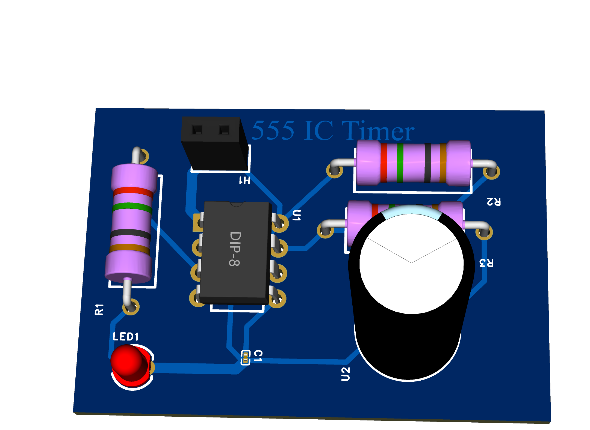
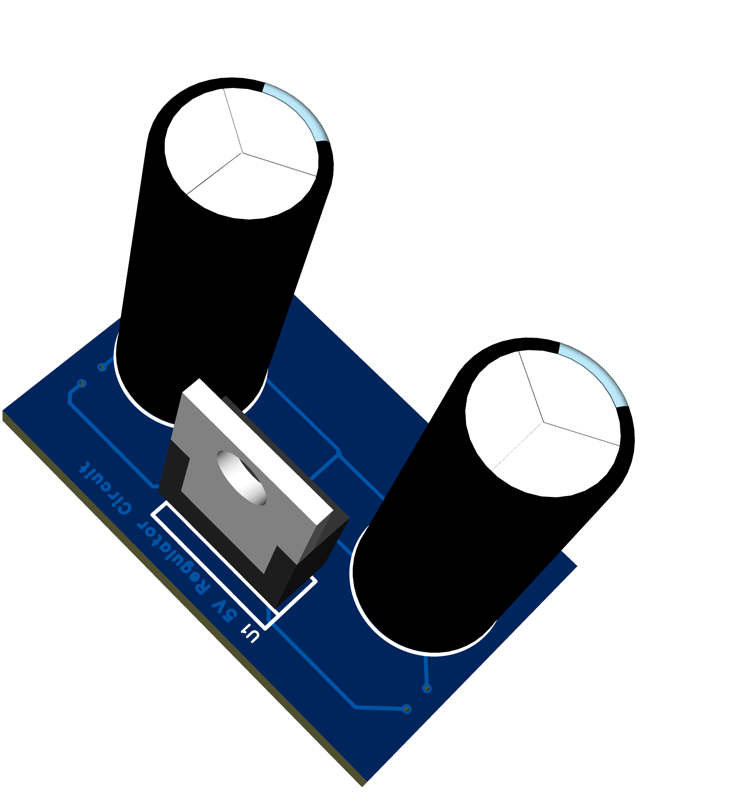
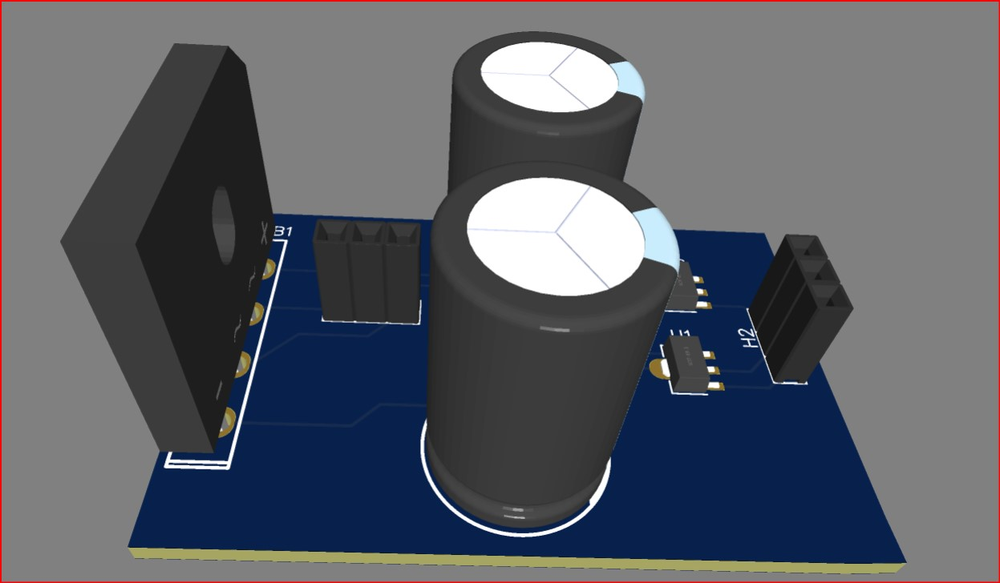
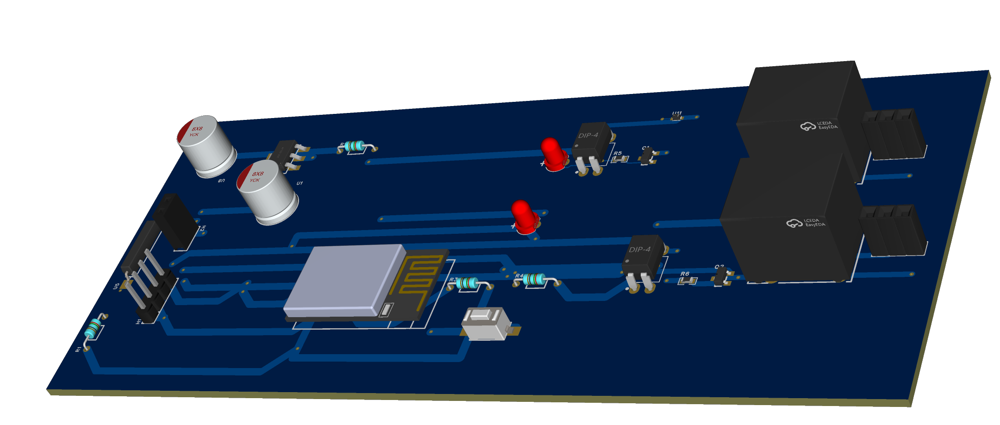
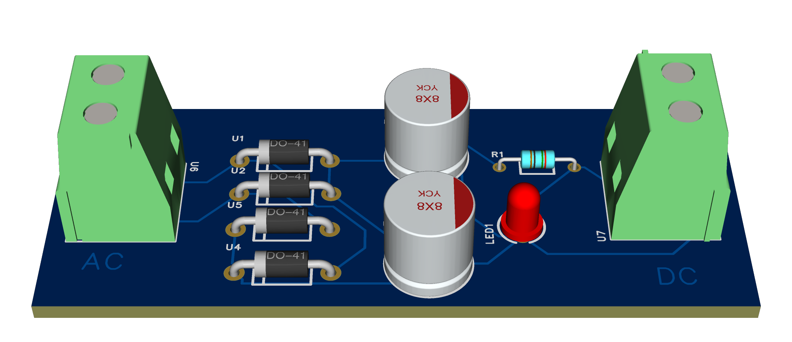
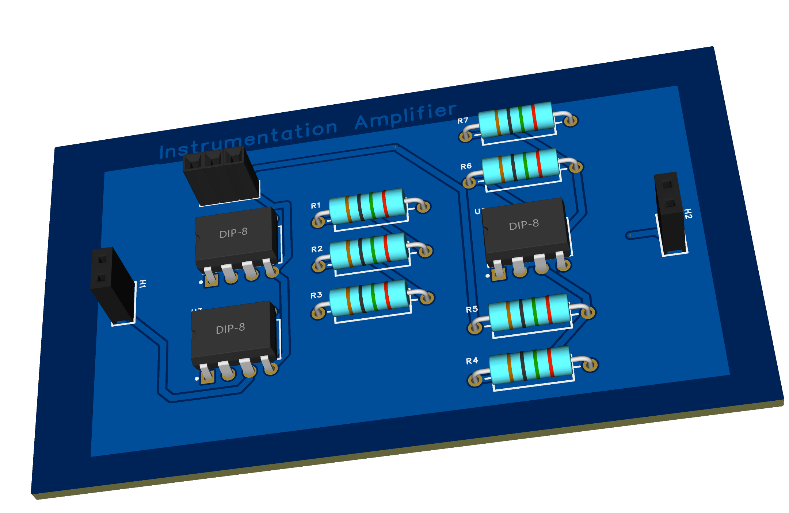
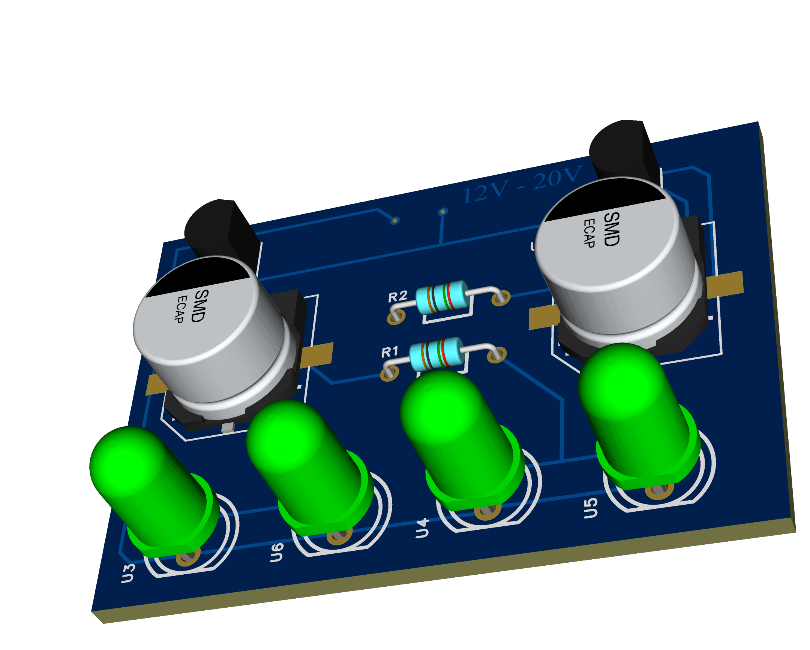
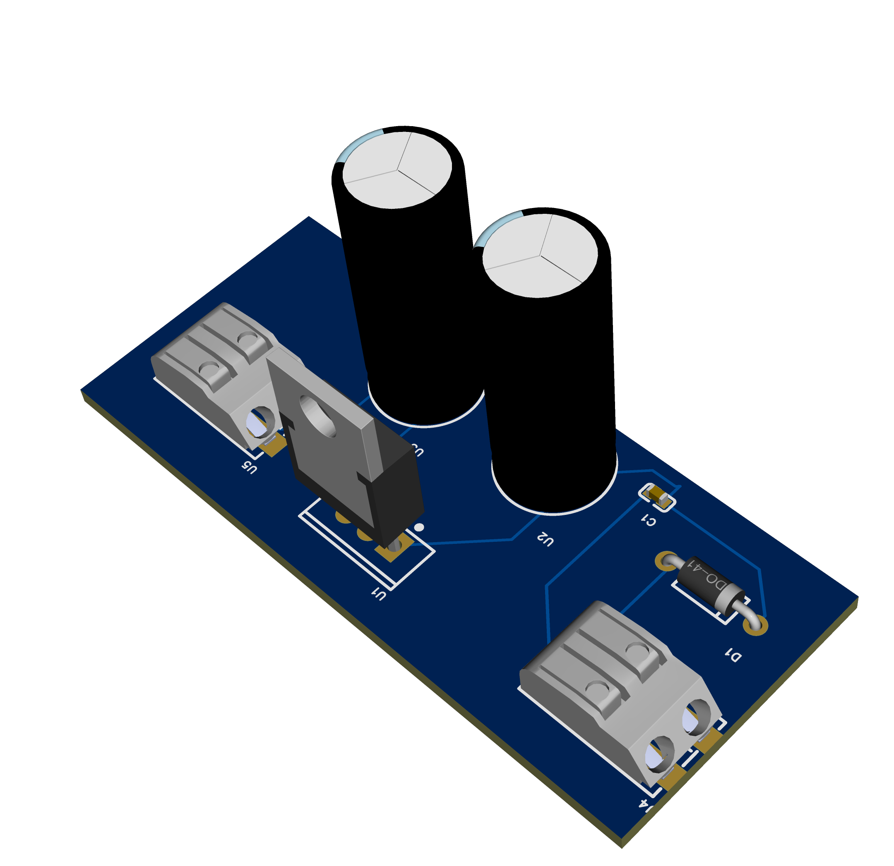

# PCB-Design-Projects 

# 555IC TIMER

# 5V DC regulator

# Push Button Control LED
 3D PCB.png)

# Dual Power Supply

# ESP Wifi Relay

# Full Wave Bridge Rectifier

# Instrimentation Amplifier

# LED chaser

# Voltage Power Regulator

